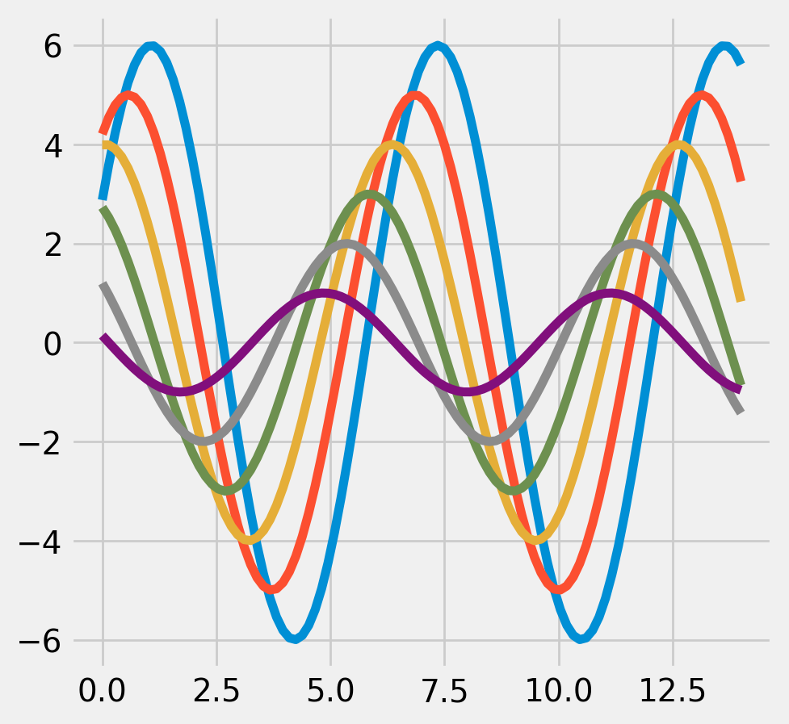
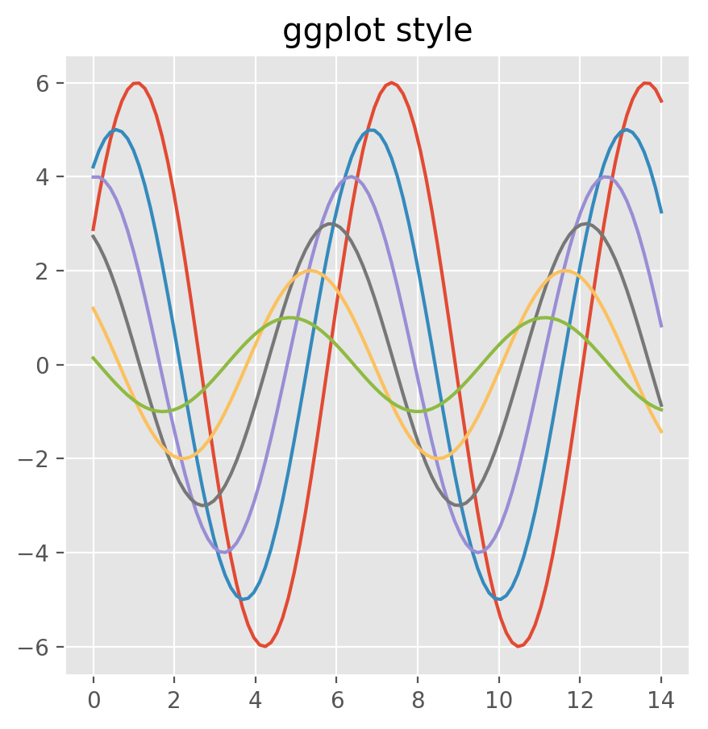
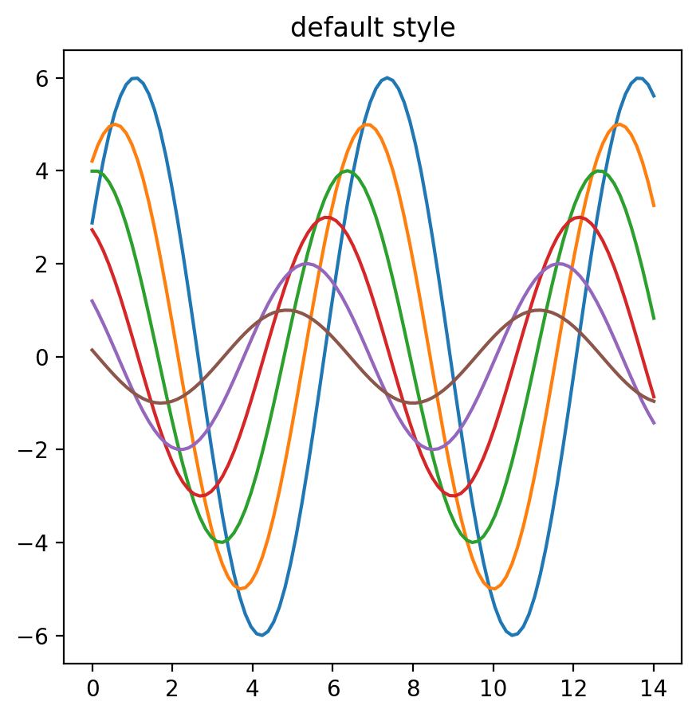
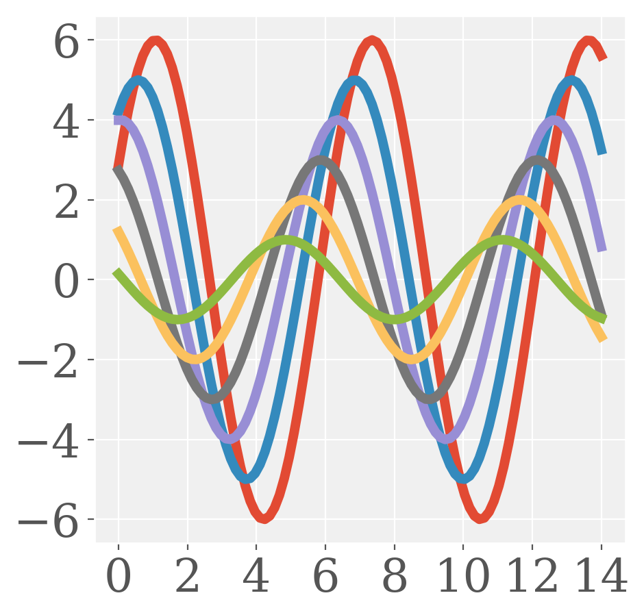

<a href="https://github.com/ipython-books/cookbook-2nd"></a> *This is one of the 100+ free recipes of the [IPython Cookbook, Second Edition](https://github.com/ipython-books/cookbook-2nd), by [Cyrille Rossant](http://cyrille.rossant.net), a guide to numerical computing and data science in the Jupyter Notebook. The ebook and printed book are available for purchase at [Packt Publishing](https://www.packtpub.com/big-data-and-business-intelligence/ipython-interactive-computing-and-visualization-cookbook-second-e).*

▶ *[Text on GitHub](https://github.com/ipython-books/cookbook-2nd) with a [CC-BY-NC-ND license](https://creativecommons.org/licenses/by-nc-nd/3.0/us/legalcode)*  
▶ *[Code on GitHub](https://github.com/ipython-books/cookbook-2nd-code) with a [MIT license](https://opensource.org/licenses/MIT)*

[*Chapter 6 : Data Visualization*](./)

# 6.1. Using matplotlib styles

Recent versions of matplotlib have significantly improved the default style of the figures. Today, matplotlib comes with a set of high-quality predefined styles along with a styling system that lets one customize all aspects of these styles.

## How to do it...

1. Let's import the libraries:

```python
import numpy as np
import matplotlib as mpl
import matplotlib.pyplot as plt
%matplotlib inline
```

2. Let's see the list of all available styles:

```python
sorted(mpl.style.available)
```

```{output:result}
['bmh',
 'classic',
 'dark_background',
 'fivethirtyeight',
 'ggplot',
 'grayscale',
 'mycustomstyle',
 'seaborn',
 ...
 'seaborn-whitegrid']
```

3. We create a plot:

```python
def doplot():
    fig, ax = plt.subplots(1, 1, figsize=(5, 5))
    t = np.linspace(-2 * np.pi, 2 * np.pi, 1000)
    x = np.linspace(0, 14, 100)
    for i in range(1, 7):
        ax.plot(x, np.sin(x + i * .5) * (7 - i))
    return ax
```

3. We can set a style with `mpl.style.use()`. All subsequent plots will use this style:

```python
mpl.style.use('fivethirtyeight')
doplot()
```



4. We can temporarily change the style for a given plot using the `with` context manager syntax:

```python
# Set the default style.
mpl.style.use('default')
# Temporarily switch to the ggplot style.
with mpl.style.context('ggplot'):
    ax = doplot()
    ax.set_title('ggplot style')
# Back to the default style.
ax = doplot()
ax.set_title('default style')
```





5. Now, we will customize the `ggplot` style by creating a new custom style to be applied in addition to `ggplot`. First, we specify the path to the custom style file, which should be in `mpl_configdir/stylelib/mycustomstyle.mpltstyle`, where `mpl_configdir` is the matplotlib config directory. Let's get this config directory:

```python
cfgdir = matplotlib.get_configdir()
cfgdir
```

```{output:result}
'/home/cyrille/.config/matplotlib'
```

6. We get the path to the file using the *pathlib* module:

```python
from pathlib import Path
p = Path(cfgdir)
stylelib = (p / 'stylelib')
stylelib.mkdir(exist_ok=True)
path = stylelib / 'mycustomstyle.mplstyle'
```

7. In this file, we specify the option of a few parameters:

```python
path.write_text('''
axes.facecolor : f0f0f0
font.family : serif
lines.linewidth : 5
xtick.labelsize : 24
ytick.labelsize : 24
''')
```

8. We need to reload the library after we add or change a style:

```python
mpl.style.reload_library()
```

9. Here is the result of the new style (we first apply the `ggplot` style, then we customize it by applying the options of our new style):

```python
with mpl.style.context(['ggplot', 'mycustomstyle']):
    doplot()
```



## There's more...

Here are a few references:

* Customizing matplotlib, at http://matplotlib.org/users/customizing.html
* Matplotlib style gallery https://tonysyu.github.io/raw_content/matplotlib-style-gallery/gallery.html
* Matplotlib: beautiful plots with style, at http://www.futurile.net/2016/02/27/matplotlib-beautiful-plots-with-style/

## See also

* Creating statistical plots easily with seaborn
